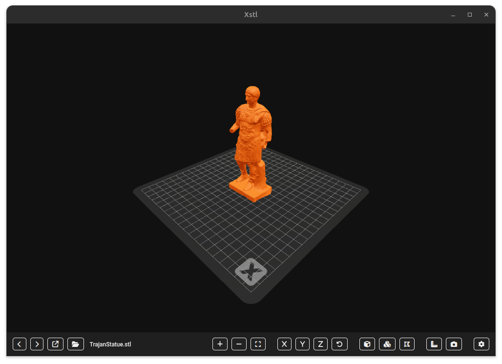
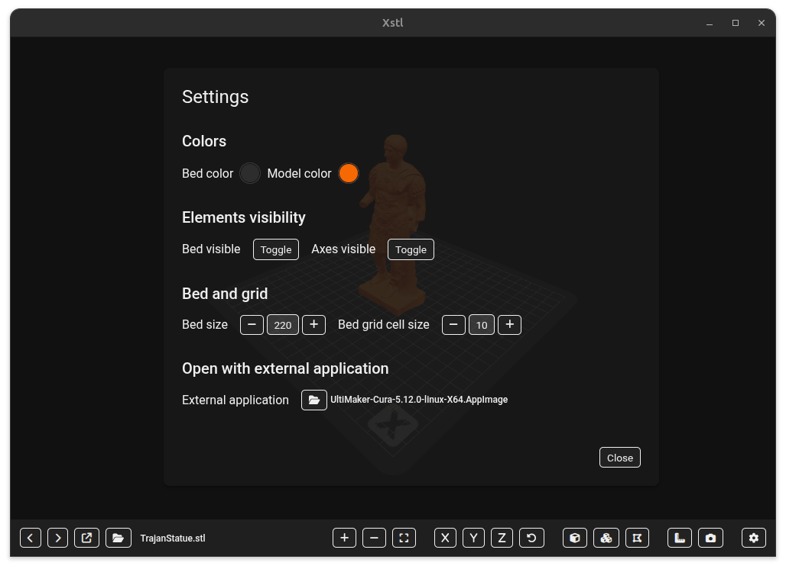

# Xstl, a free and open-source STL viewer

Xstl is a free and open-source STL viewer for Linux and Windows, built with modern tools, Electron and React. With Xstl you can open an STL file and navigate through a directory to see all STL files in it, using buttons or keyboard shortcuts (`Arrow Left` and `Arrow Right`). The default view is isometric, so you can see all the details of your model.



## Settings and customization

By changing the default settings you can visualized your model in different colors. The bed is configurable/switchable too.



## Install

To install Xstl, check the releases page https://github.com/emanuelescarabattoli/xstl/releases

## Set as default program

To set Xstl as default STL files viewer on Windows:

- Double-click on a `.stl` file
- Select "Open with another program"
- Navigate to `C:\Users\<your user>\AppData\Local\Programs\Xstl` folder
- Select `Xstl.exe`

To set Xstl as default STL files viewer on Linux:

- Double-click on a `.stl` file
- In the window that will open, search for "Xstl" and select it

## Build instructions

Here are the instructions to build the project.

- Use Node.js 18+ (recommended Node.js 20+)
- Change the version in `./wrapper/package.json` if you want to perform a release

- From the repository root, install frontend dependencies using pnpm
```
cd ./frontend
pnpm install
```

- Then install wrapper dependencies using npm
```
cd ../wrapper
npm install
```

- To build Debian package
```
npm run build-deb
```

- To build AppImage package
```
npm run build-app-image
```

- To build Windows setup package
```
npm run build-win
```

## Local setup

To run the project locally after cloning it, do the following.

- In a first terminal, navigate to the frontend directory and install dependencies using pnpm
```
cd frontend
pnpm install
```

- Run the frontend dev server
```
pnpm dev
```

- In a second terminal, navigate to the wrapper directory and install dependencies using npm
```
cd wrapper
npm install
```

- Run the Electron wrapper in development mode
```
npm run dev
```

- Now the application is running locally

## Contribute

Feel free to contribute to this project here https://github.com/emanuelescarabattoli/xstl/pulls or open an issue here https://github.com/emanuelescarabattoli/xstl/issues

## License

Licensed under the MIT license.
