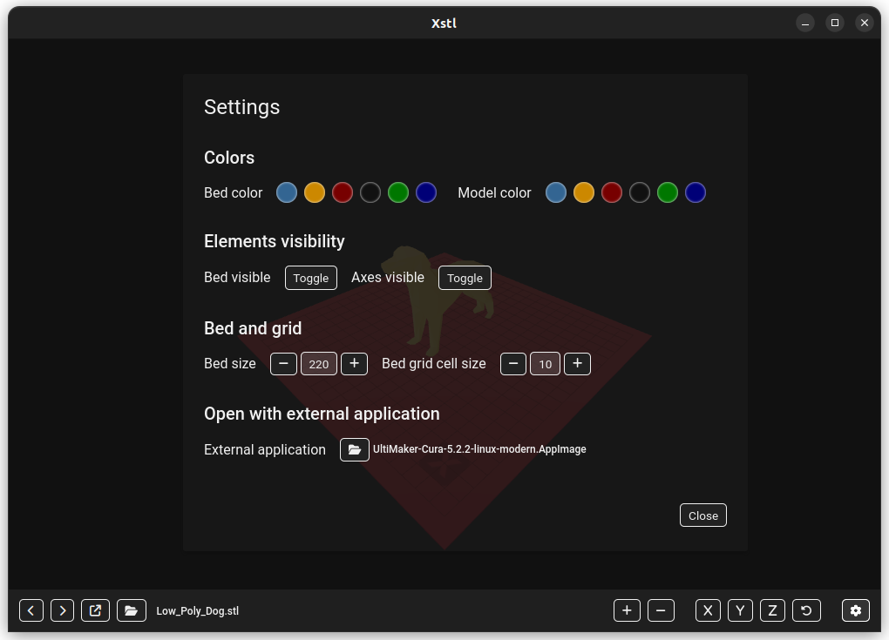

# Xstl, a free and open-source STL viewer

Xstl is a free and open-source STL viewer build with modern tools, Electron and React. With Xstl you can open an STL file and navigate trough a directory to see all the STL files on it, buy using buttons or with a shortcut (`alt+z` and `alt+x`). The default view is isometric, so you can see all the details of your model.


## Settings and customization

By changing the default settings you can visualized your model in different colors. The bed is configurable/switchable too.



## Build instructions

Here the instructions to build your `deb` or `AppImage` package:

- Navigate to xtl code folder, wrapper sub-directory
```
cd ./xstl/wrapper
```
- Install packages using yarn
```
yarn install
```
- To build deb package
```
yarn build-deb
```
- To build AppImage package
```
yarn build-app-image

```

## Local setup

To run the project locally, after cloning it, do the following

- Open a terminal, navigate to the frontend directory and install dependencies using yarn
```
cd frontned
yarn install
```
- Run the React project
```
yarn start
```
- You can close the browser tab that will open up
- In another terminal, navigate to the electron application directory and install dependencies using yarn
```
cd wrapper
yarn install
```
- Run the project
```
yarn start
```
- Now the application is running locally

## Contribute

Feel free yo contribute to this project in here https://github.com/emanuelescarabattoli/xstl/pulls

## License

Licensed under the MIT license.
