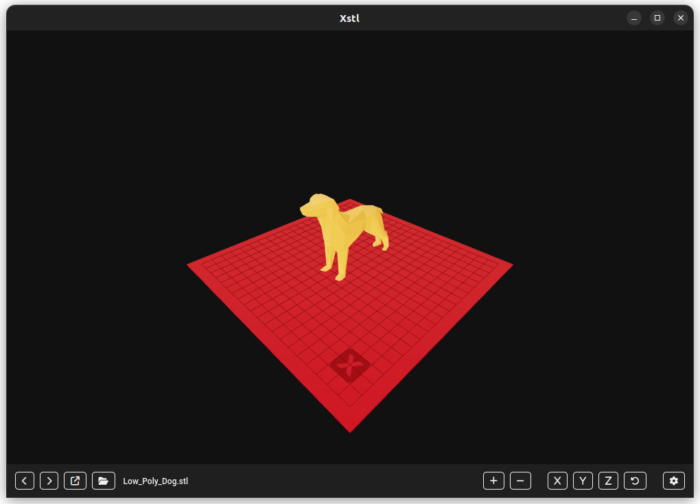

# Xstl, a free and open-source STL viewer

Xstl is a free and open-source STL viewer build with modern tools, Electron and React. With Xstl you can open an STL file and navigate trough a directory to see all the STL files on it, buy using buttons or with a shortcut (`alt+z` and `alt+x`). The default view is isometric, so you can see all the details of your model.



## Settings and customization

By changing the default settings you can visualized your model in different colors. The bed is configurable/switchable too.


## Build

Here the instructions to build your `deb` or `AppImage` package

```
// Navigate to xtl code folder, wrapper sub-directory
cd ./xstl/wrapper

// Install node packages
yarn install

// Build deb package
yarn build-deb

// Build AppImage package
yarn build-deb

```
